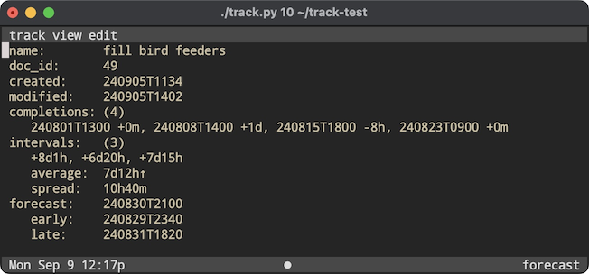
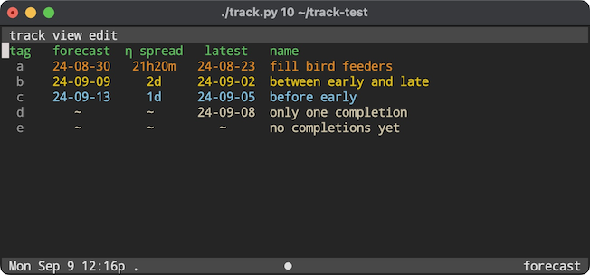

# track

This is a simple application for tracking the sequence of occasions on which tasks are completed.

As an example, consider the task of "filling the bird feeders". Suppose you want to have an idea when you should next fill them. One approach would be to set a reminder to fill them every 14 days starting from the last time you filled them. When the reminder is triggered, you could check the feeders to see if they are empty. If they are, you could fill them and then perhaps adjust the reminder to repeat every 12 days. On the other hand, if they are not empty, you might adjust the reminder to repeat every 16 days. Repeating this process, you might eventually set a repetition frequency for the reminder that predicts fairly well the next time you should fill them.

The goal of *track* is to save you trouble of going through this iterative process. Here's how it works:

1. In *track*, press "n" to add a new tracker and name it "fill bird feeders".
2. The first time you fill the feeders, press "c" to add a completion, select the "fill bird feeders" tracker and enter the date and time of the completion. This date and time will be added to the history of completions for the "fill bird feeders" tracker.
3. The next time you need to fill the feeders, repeat the process described in step 2. At this point, you will have two datetimes in the history of the tracker, track will calculate the interval between them and set the "expected next completion" by adding the interval to last completion date and time.
4. The process repeats with each completion. There are only two differences when there are more than 2 completions:
   - The "expected next completion" is calculated by adding the *average* of the intervals to the last completion date and time.
   - If there are more than 12 completions, only the last 12 completions are used to calculate the average interval. The estimated next completion date and time is thus based only on the average of the intervals for the most recent 12 completions.

One slight wrinkle when adding a completion is that you might have filled the bird feeders because it was a convenient time even though you estimate that you could have waited another day. In this case the actual interval should be the difference between the last completion date and the current completion date plus one day. On the other hand, you might have noticed that the feeders were empty on the previous day but weren't able to fill them. In this case the actual interval should be the difference between the last completion date and the current completion date minus one day. To accommodate this, when adding a completion you can optionally specify the interval adjustment. E.g., "4p, +1d" would add a completion for 4pm today with an estimate that the completion could have been postponed by one day. Similarly, "4p, -1d" would add a completion for 4pm today with an estimate that the completion should have been done one day earlier.

The recorded history of completions is thus a list of (datetime, timedelta) pairs with the default timedelta being zero minutes with a corresponding list of intervals

      history: [(dt[0], td[0]), (dt[1], td[1]), (dt[2], td[2]), ...]
      intervals: [dt[1] + td[1] - dt[0], dt[2] + td[2] - dt[1], ...]

Here is a part of a screenshot from the "inspect" display for the "fill bird feeders" tracker showing a history of four completions together with the corresponding three intervals and other related calculations:

Note that the first interval, 8 days 1 hour, is the difference between 240808T1400 + 1 day and 240808T1300.  The other intervals are computed in the same way. The average interval is just the sum of the three intervals divided by 3. The little upward pointing arrow after the average interval indicates that, since the last interval is greater than the average, the average is increasing.  The spread is the average of the absolute values of the differences between the intervals and the average interval. This MAD (mean average deviation) is a standard measure of the spread of a series. These calculations are used in two ways:

1. The forecast for when the next completion will be due is the sum of the last completion datetime and the average interval.
2. The confidence we might have in this forecast depends upon the spread. If the spread is small, we would expect the actual interval between the last completion and the next completion to be close to the average. Chebyshev's Inequality says, in fact, that the proportion of intervals that lie within k * spread of the average interval must be at least 1 - 1/k^2. In the screenshot "early" is forecast - k * spread and "late" is forecast + k * spread, where k, by default, is 2 (user setting). With this setting at least 75% of the intervals would put the actual outcome between "early" and "late".

The main, list view reflects theses calculations. Here is a screenshot again showing the bird feeder example:

Since it is currently 2:24pm on September 6 and this is past "late" for the bird feeders, the display shows the bird feeder tracker in a warning color, burnt orange. By comparison, the forecast for "between early and late" is actually today and since the current time is within 2 * 12h of the forecast, "between early and late" gets an alert color, gold. Finally the forecast for "before early" is September 13 and since the current time is more than 2 * 12h before the forecast, "before early" gets a not-yet-relevant color, blue.

By default, trackers are sorted by "forecast" but it is also possible to sort by "latest", "name" or "doc_id".  The "forecast" setting lists the trackers in the order in which they will likely need to be completed and colors them by the likely urgency.
